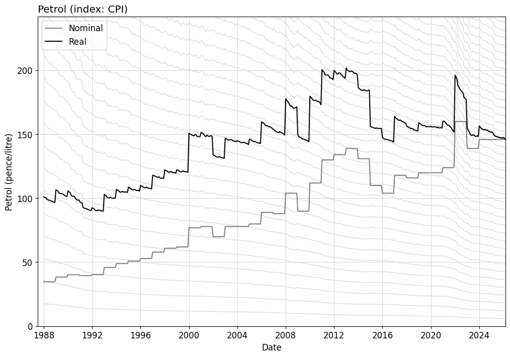

# Inflation plot script

`inflation.py` reads a time series for a quantity from a YAML file and uses up to date [ONS inflation data](https://www.ons.gov.uk/economy/inflationandpriceindices) to compute inflation-adjusted values.

The script then generates a plot showing both the nominal quantity and its real value going back through time, so we can see how the quantity changes after adjusting for inflation.
Any values that can exist as a timeseries between 1988 and today can be used, eg prices, valuations, salaries etc.

The following inflation indices are supported:
- CPI
- CPIH
- RPI

## Usage

- Edit the YAML file referenced by `filename` in `inflation.py`
- Run the script with `python inflation.py`
- The script saves a plot file showing the inflation-adjusted series

## Example

The following shows the price of petrol in nominal and real terms (according to CPI) since 1988 ([data](http://www.speedlimit.org.uk/petrolprices.html)).

